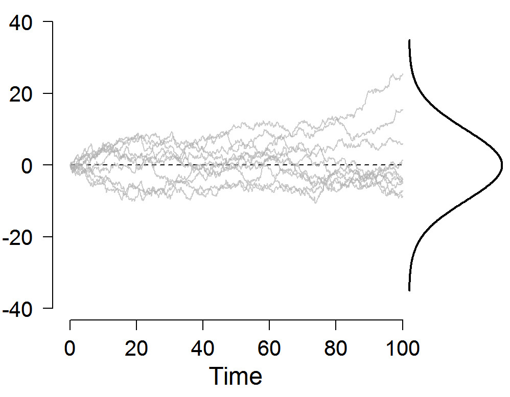

```{r setup, include=FALSE}
knitr::opts_chunk$set(echo = FALSE, message=FALSE, warning=FALSE)
```

```{r eval=FALSE, echo=FALSE}
rmarkdown::render_site()
install.packages("knitr")
install.packages("rmarkdown")
install.packages("ggvis")
install.packages("googleVis")
install.packages("corrplot")
install.packages("PerformanceAnalytics")

```


# Objectif

La première séance a pour but de se familiarer avec les différents graphiques réalisables avec R. Cette deuxième séance est divisée en deux parties:

- mieux communiquer les informations sur les données en assurance
- mieux comprendre certaines notions techniques actuarielles

# Corrélation linéaire

## Quelques généralités

- Ne pas confondre corrélation et causalité (voir spurious correlation)
- Distinguer la corrélation linéaire et la corrélation de Spearman
- Comprendre les inconvénients, voir [Embrechts](https://people.math.ethz.ch/~embrecht/)

## Corrélation linéaire

Utiliser `corrplot` (du package éponyme) pour visualiser les corrélations linéaires entre les différentes variables (de la série de données `mtcars`, `iris`, `economics` par exemple).

```{r}
mcor <- cor(mtcars)
library(corrplot)
corrplot(mcor, type="upper", order="hclust", tl.col="black", tl.srt=45)
```

Utiliser la fonction `chart.Correlation` du package `PerformanceAnalytics`

```{r}
library(PerformanceAnalytics)
mydata <- mtcars[, c(1,3,4,5,6,7)]
chart.Correlation(mydata, histogram=TRUE, pch=19)

```

Utiliser un heatmap:

```{r}
col<- colorRampPalette(c("blue", "white", "red"))(20)
heatmap(x = mcor, col = col, symm = TRUE)
```

## Inconvénient de la corrélation linéaire

Etant données deux lois lognormales, on peut exprimer la corrélation linéaire en fonction de leurs paramètres.
Montrer qu'on peut trouver une limite supérieure et une limite inférieure, et tracer le graphique suivant:

```{r}
sigma=seq(0.01,5,0.01)
rho=1
plot(sigma,exp(0.5)*exp(sigma^2/2)*(exp(rho*sigma)-1)/sqrt((exp(1)-1)*exp(1)*exp(sigma^2)*(exp(sigma^2)-1)),
     ylim=c(-1,1),type="l",xlab=expression(sigma),
     ylab="corrélation linéaire",main=expression("Bornes de la corrélation linéaire entre LN(0,1) et LN(0,"*sigma*")"))
legend(2.5,0.9,c("Corrélation maximale","Corrélation minimale"),col=c(1,2),lty=1,lwd=1,bty = "n")
rho=-1

lines(sigma,exp(0.5)*exp(sigma^2/2)*(exp(rho*sigma)-1)/sqrt((exp(1)-1)*exp(1)*exp(sigma^2)*(exp(sigma^2)-1)),col=2)
```

# Copules

Les copules permettent d'expliciter totalement la relation de dépendance entre deux variables aléatoires.
Lire [cet article](http://datascienceplus.com/modelling-dependence-with-copulas/) et créer des graphiques en 3D avec threejs pour visualiser le comportement des copules.

# QQplot

Le qqplot de base n'est pas interactif. Créer un qqplot interactif.

```{r}
set.seed(1)
x <- rnorm(80, mean=50, sd=5)
y <- runif(80)
qqnorm(x)
qqline(x)
qqnorm(y)
qqline(y)

```

# Courbes des taux

Visualiser les simulations pour des courbes de taux selon le modèle de Vasicek, et tracer le graphique suivant.



# D'autres notions techniques

- Table de mortalité
- Sinistralité, pour un modèle fréquence coût, visualiser les courbes AEP, OEP, et nombres de sinistres par tranche.
- A vous de trouver

